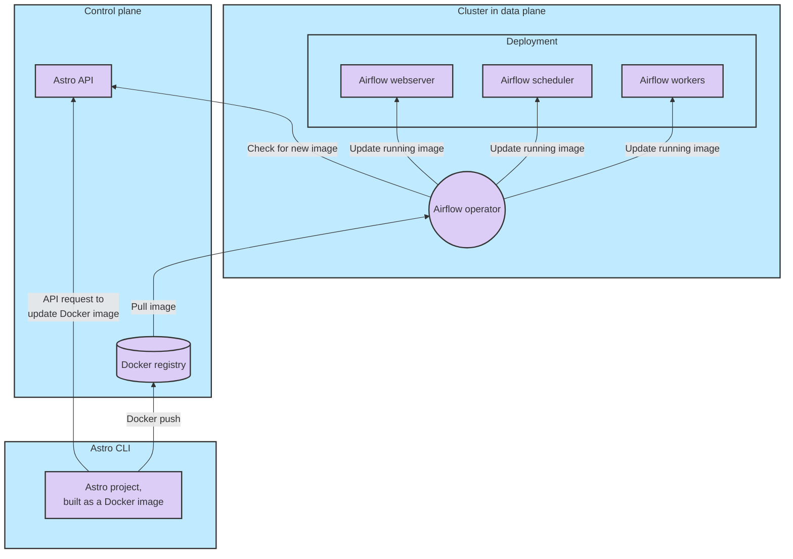
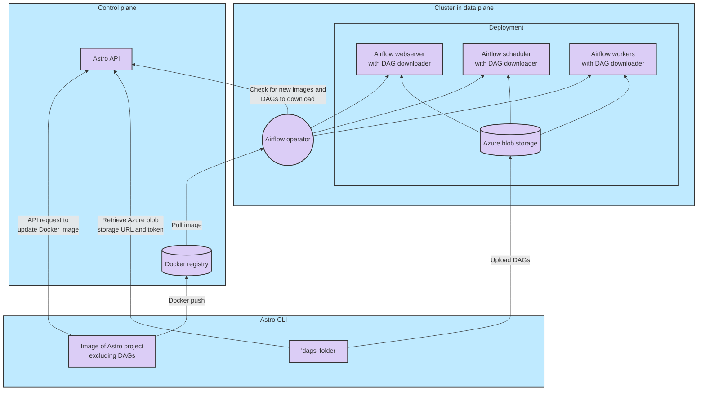

import {siteVariables} from '@site/src/versions';

Using the Astro CLI to push your Astro project, including your DAG code, to a Deployment is the foundation for managing changes on Astro. Astro supports two types of deployment options:

- `astro deploy`: This command pushes every file in your Astro project to all Airflow components in your Deployment. This includes your `Dockerfile`, DAGs, plugins, and all Python and OS-level packages.
- `astro deploy --dags`: This command pushes only the code that exists in the `/dags` directory of your Astro project to a running Deployment on Astro. When you only need to push changes to your DAGs, running this command is a faster development experience than running `astro deploy` since it does not require installing your dependencies.

To run `astro deploy --dags`, you must first enable the [DAG-only deploys](deploy-code.md#deploy-dags-only) feature for each Deployment.

Follow the steps in this document to manually push your Astro project to a Deployment. For production environments, Astronomer recommends automating all code deploys with CI/CD. See [CI/CD](ci-cd.md).

## Prerequisites

- The [Astro CLI](cli/overview.md) installed in an empty directory.
- An Astro Workspace with at least one [Deployment](create-deployment.md).
- An [Astro project](create-project.md).
- [Docker](https://www.docker.com/products/docker-desktop).

## Step 1: Authenticate to Astro

Run the following command to authenticate to Astro:

```sh
astro login
```

After running this command, you are prompted to open your web browser and log in to the Cloud UI. Once you complete this login, you are automatically authenticated to the CLI.

:::tip

If you have [Deployment API key](api-keys.md) credentials set as OS-level environment variables on your local machine, you can deploy directly to Astro without needing to manually authenticate. This setup is required for automating code deploys with [CI/CD](ci-cd.md).

:::

## Step 2: Push your Astro project to an Astro Deployment

To deploy your Astro project, run:

```sh
astro deploy
```

This command returns a list of Deployments available in your Workspace and prompts you to pick one.

After you select a Deployment, the CLI parses your DAGs to ensure that they don't contain basic syntax and import errors. This test is equivalent to the one that runs during `astro dev parse` in a local Airflow environment. If any of your DAGs fail this parse, the deploy to Astro also fails.

If your code passes the parse, the Astro CLI builds all files in your Astro project directory into a new Docker image and then pushes the image to your Deployment on Astro. If the DAG-only deploy feature is enabled for your Deployment, the `/dags` directory is excluded from this Docker image and pushed separately. To force a deploy even if your project has DAG errors, you can run `astro deploy --force`.

:::tip

To validate your code before deploying it to Astro, you can run `astro deploy --pytest`. Adding the `--pytest` flag makes the CLI run all tests in your project's `tests` directory using [pytest](https://docs.pytest.org/en/7.0.x/contents.html). If any of these tests fail, your code deploy also fails. This can help you prevent your team from deploying DAGs to Astro that contain errors.

For more information about using Pytest, see [Test and troubleshoot locally](test-and-troubleshoot-locally.md#test-dags-locally-with-pytest).

:::

## Step 3: Validate your changes

After the deploy completes, Docker image information for your Deployment is available in the **Image tag** field in the footer of the Airflow UI. Depending on how your organization deploys to Astro, the **Image tag** field displays a unique identifier generated by a Continuous Integration (CI) tool or a timestamp generated by the Astro CLI on `astro deploy`. The **Image tag** field in the Airflow UI footer identifies the Docker image running on the webserver of your Deployment. This information can help you determine if your deploy was successful, but it does not identify the Docker image running on your scheduler, triggerer, or workers. To confirm a code push with complete certainty, contact [Astronomer support](https://cloud.astronomer.io/support).

1. In the Cloud UI, select a Workspace and then select the Deployment you pushed code to.
2. Click **Open Airflow**.
3. Scroll to the bottom of the page and view the **Image tag** information in the footer:

    

## Deploy DAGs only

:::caution

This feature in [Public Preview](feature-previews.md).

:::

To enable the ability to push only DAGs to Astro for a faster development experience, you must enable the feature for each Deployment. You only need to enable the feature once. When it is enabled, you must still run `astro deploy` when you make a change to any file in your Astro project that is not in the `dags` directory.

Enabling DAG-only deploys on Astro has a few benefits:

- DAG-only deploys are significantly faster than running `astro deploy` when you have only made changes to your DAGs.
- When you run `astro deploy --dags`, the workers and schedulers in your Deployment will pick up your changes gracefully and will not restart. This results in a more efficient use of running workers and no downtime for your Deployment.
- You can have different sets of users deploy project changes versus DAG changes. See [DAG-based workflows](ci-cd.md#dag-based-workflows) for how you can set this up in your CI/CD pipelines.

### Enable DAG-only deploys


1. Run the following command:

    ```sh
    astro deployment update --dag-deploy enable
    ```

2. When the prompt appears in the Astro CLI, select a Deployment where you want to enable the feature. Running tasks will not be interrupted and new tasks will continue to be scheduled.

To disable the DAG-only deploy feature, contact [Astronomer support](https://cloud.astronomer.io/support).

### Trigger a DAG-only deploy

Triggering a DAG-only deploy pushes DAGs to Astro and mounts them to the workers and schedulers in your Deployment. DAG-only deploys do not disrupt running tasks and do not cause any components to restart when you push code. If you deploy changes to a DAG that is currently running, active task runs finish executing according to the code from before you triggered a deploy. New task runs are scheduled using the code from your latest deploy.

Run the following command to deploy only your `dags` directory to a Deployment:

```sh
astro deploy --dags
```

## Code deploy workflow

The code deploy workflow varies based on whether a Deployment has [DAG-only deploys](#deploy-dags-only) enabled. 

### Deploy process before DAG deploys are enabled

When you deploy code to Astro, the Astro CLI builds your Astro project into a Docker image. This includes system-level dependencies, Python-level dependencies, DAGs, and your `Dockerfile`. It does not include files that are for local development only, such as `.env` and `airflow_settings.yaml`, or any of the metadata associated with your local Airflow environment, including task history, Airflow connections, and variables. This Docker image is then pushed to all containers running Airflow on Astro. 



#### Downtime after a code deploy

With the exception of the Airflow webserver and some Celery workers, Kubernetes terminates all containers after a code deploy. This forces them to restart and begin running your latest code.

The following is the workflow for a code deployment to a Deployment that is running a previous version of your code:

- Tasks that are `running` continue to execute on existing Celery workers and are not interrupted unless the task does not complete within 24 hours of the code deploy.
- One or more new workers are created alongside your existing workers and start executing scheduled tasks based on your latest code.

    These new workers execute downstream tasks of DAG runs that are in progress. For example, if you deploy to Astronomer when `Task A` of your DAG is running, `Task A` continues to run on an old Celery worker. If `Task B` and `Task C` are downstream of `Task A`, they will both be scheduled on new Celery workers running your latest code.

    This means that DAG runs could fail due to downstream tasks running code from a different source than their upstream tasks. DAG runs that fail this way need to be fully restarted from the Airflow UI so that all tasks are executed based on the same source code.

Astronomer sets a grace period of 24 hours for all workers to allow running tasks to continue executing. This grace period is not configurable. If a task does not complete within 24 hours, its worker is terminated. Airflow marks the task as a [zombie](https://airflow.apache.org/docs/apache-airflow/stable/concepts/tasks.html#zombie-undead-tasks) and it will retry according to the task's retry policy. This is to ensure that Astronomer can reliably upgrade and maintain Astro as a service.

:::tip

To force long-running tasks to terminate sooner than 24 hours, specify an [`execution_timeout`](https://airflow.apache.org/docs/apache-airflow/stable/concepts/tasks.html#timeouts) in your DAG's task definition.

:::

### Deploy process after DAG deploys are enabled

If a Deployment has DAG deploys enabled, your Deployment includes the following additional components: 

- Azure Blob Storage
- A sidecar for downloading DAGs attached to each Airflow component container.
  
When you run `astro deploy` with DAG deploys enabled, the Astro CLI still deploys parts of your project as a Docker image. However, a different process for deploying DAGs runs simultaneously.


- The Astro CLI builds an image of your Astro project excluding the `dags` folder.
- The Astro CLI uploads your `dags` folder to the Deployment's Azure Blob Storage.
- The DAG downloader sidecars download the new DAGs from Azure Blob Storage.



If you run `astro deploy` to deploy your entire Astro project, your Deployment's Airflow containers will restart as described in [Downtime after a code deploy](#downtime-after-a-code-deploy). 

If you run `astro deploy --dags`, the CLI does not push a new Docker image of your project and only uploads the `dags` folder to Azure Blob Storage, meaning that no containers in your Deployment are terminated. Workers which are running at the time of the deploy complete their DAG runs using DAG code from before the deploy, while new workers use your latest DAG code.

## Related documentation

- [Automate code deploys with CI/CD](ci-cd.md)
- [Develop your project](develop-project.md)
- [Set environment variables](environment-variables.md)
