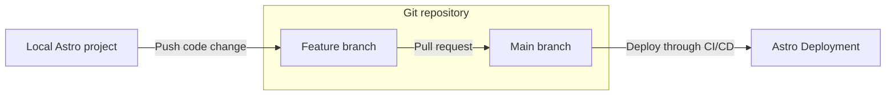
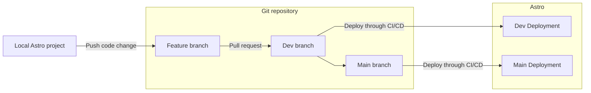
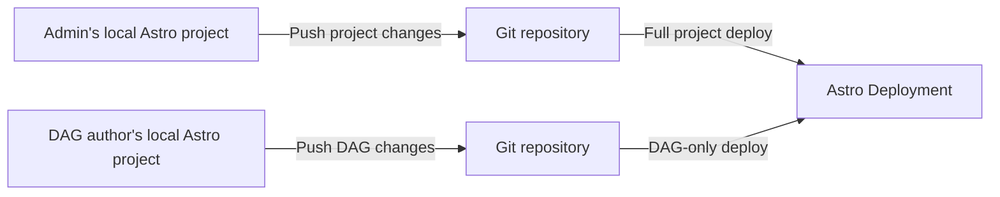
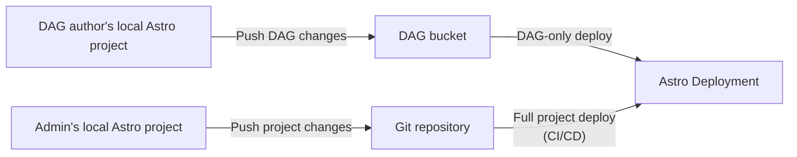

Continuous Integration and Continuous Delivery (CI/CD) pipelines are programmatic workflows that automate key parts of the software development lifecycle, including code changes, builds, and testing. CI/CD helps your organization develop faster, more securely, and more reliably.

There are many strategies for organizing your source code and building CI/CD pipelines for Apache Airflow on Astro, and each has its own benefits and limitations. Use this document to:

- Learn the benefits of CI/CD.
- Determine what kind of Deployment and CI/CD strategy you want your data team to use.

When you're ready to implement your CI/CD strategy, see [CI/CD templates](ci-cd-templates/template-overview.md) for setup steps and examples for third-party CI/CD tools, like GitHub Actions and CircleCI.

## Benefits of CI/CD on Astro

On Astro, you can use [Deployment API keys](api-keys.md) to automate your code deploys. Astronomer recommends hosting your Astro project source code in a version control tool, such as [GitHub](https://github.com/) or [GitLab](https://about.gitlab.com/), and setting up a CI/CD workflow for all production environments.

There are many benefits to configuring a CI/CD workflow on Astro. Specifically, you can:

- Avoid manually running `astro deploy` every time you make a change to your Astro project.
- Ensure that all changes to your Astro project are reviewed and approved by your team before they get pushed to Astro.
- Automate promoting code across development and production environments on Astro when pull requests to certain branches are merged.
- Enforce automated testing, which increases code quality and allows your team to respond quickly in case of an error or a failure.

## Choose a deploy strategy

You can set up CI/CD pipelines to manage multiple Deployments and repositories based on your team structure. Before you create your pipeline, you need to determine how many project environments and repositories you want to maintain.

When deciding on a strategy, keep the size of your data team and the importance of your Airflow DAGs in mind while answering the following questions:

- How many different environments do you need and want to invest in to adequately test your DAGs before deploying them to production?
- Do you need to limit your DAG authors' access to sensitive project configurations? If so, do you need to host your Astro project in multiple repositories?
  
Read the following topics to learn which combination of environments and repositories is right for your team. Advanced data teams might follow a custom CI/CD strategy that is not described here and is optimized for a particular use case or team structure. If you're not sure which CI/CD strategy is right for you, contact your customer success representative.

### Environments

When you create a CI/CD pipeline, you must first determine how many environments you need to test your DAGs in. This typically depends on how critical these DAGs are to your business and how much your team expects to spend in infrastructure.

Each environment requires a Deployment on Astro, as well as its own GitHub branch and implementation in your CI/CD pipeline. 

#### Single environment

The most cost-effective way to get started with CI/CD on Astro is to maintain a single Deployment on Astro for one Astro project. This solution is best for simple projects where you can tolerate testing and bug fixing in production.

This method assumes that you have:

- One Astro project.
- One Astro Workspace for your project.
- One Astro Deployment.
- One primary and permanent branch in your Git repository. Astronomer recommends `main`.

With this method, you can configure a CI/CD pipeline that deploys code to Astro every time a change is made to an Astro project file in your Git repository. To deploy a change to your project:

- Create a new, temporary branch in your Git repository against the `main` branch.
- Make a change to your Astro project and push those changes to the branch. 
- Test all project changes locally with the Astro CLI. See [Test and troubleshoot locally](test-and-troubleshoot-locally.md).
- Open a pull request for review.
- When the pull request is approved and merged to the `main` branch, the change is automatically deployed to your Deployment on Astro and available in the Airflow UI.

Running all of your data pipelines in a single environment means that you don't have to pay for the infrastructure of multiple Deployments, but it limits your ability to test changes on Astro or on development datasets before they are deployed. Astronomer does not recommend this method for production use cases.

#### Multiple environments

For data teams running DAGs which are critical to your business, Astronomer recommends developing a CI/CD pipeline that supports multiple environments for running and testing different versions of your project, such as a production and development environment.

With this method, you maintain one Git repository with multiple permanent branches that each represent an environment in which you want to test your Astro project. You also have multiple Astro Deployments in a single Workspace that each correspond to one of the permanent branches. If you work at a larger organization, you can adapt this method by creating a Workspace and Astro project for each team or business use case.

The multiple environment method assumes that you have:

- One Astro project.
- One Astro Workspace for your project.
- At least two permanent branches in your Git repository that each represent an environment. Astronomer recommends naming the branches `main` and `dev`.
- At least two Astro Deployments.

This method provides your team with at least two environments on Astro to test before pushing changes to production. Each Deployment can contain separate versions of your code, as well as separate environment configurations. If you use Snowflake, for example, your development Deployment on Astro can use a virtual data warehouse for development (`DWH Dev`), and your production Deployment can use a different virtual data warehouse for production (`DWH Prod`).

### Repositories

Astro supports deploying DAG code changes separately from project configuration changes. This means that when you create a CI/CD pipeline for an Astro project, you can choose between the following strategies:

- Maintain a single Git repository for all files in your Astro project.
- Separate your DAGs from other files and maintain multiple Git repositories for a single Astro project.
- Store your DAGs in a cloud provider storage solution, such as AWS S3, and the rest of your Astro project files in a dedicated Git repository.

Develop this strategy in conjunction with your strategy for managing environments. Your CI/CD pipeline can manage deploying multiple branches across multiple repositories. See [Environments](#environments).

#### One repository

For most teams, Astronomer recommends creating a single Git repository for each Astro project. This means that your team can make changes to your DAGs, Python packages, and Deployment configuration in a single place. This strategy keeps your code history centralized, makes it easy for developers to contribute code, and avoids synchronization problems across files.

This strategy is recommended if:

- A single team is responsible for both developing DAGs and maintaining Deployments on Astro.
- You don't require a dedicated repository for DAGs across your organization.
- Less than 30 people interact with or contribute to your Astro project.
  
#### Multiple repositories

Depending on your organization, you might be required to maintain multiple repositories for a single Astro project. Data teams that implement this strategy typically manage DAGs in one repository and Astro project settings, such as Python packages and worker configuration, in another repository.

This strategy is recommended if:

- You have strict security requirements for who can update specific project files.  
- You want to minimize complexity for project contributors at the expense of a more complex CI/CD pipeline. 

One limitation of this strategy is that you must keep any local copies of the Astro project synchronized with both repositories in order to test Deployment code locally. Your team members might have inconsistencies in their local environments if they can't access code changes from other team members. Astronomer recommends setting up a `dev` Deployment where DAG authors can see and modify project configurations for testing purposes. 

This strategy requires enabling [DAG-only deploys](deploy-code.md#enable-dag-only-deploys-on-a-deployment) on the target Deployment and setting up your CI/CD pipeline on both Git repositories.

### Store DAGs in storage bucket

Similar to the multiple repository strategy, this strategy separates the management of DAGs and project configuration. DAGs are stored in an [S3](https://aws.amazon.com/s3/) or [Google Cloud Storage (GCS)](https://cloud.google.com/storage) bucket, while Astro project configuration files are stored in a Git repository. 

If you migrated to Astro from Amazon Managed Workflows for Apache Airflow (MWAA) or Google Cloud Composer (GCC), this strategy is useful for maintaining a similar workflow for DAG authors. For example, you can set up a Lambda function to push DAGs to your Astronomer Deployment whenever DAG files are updated in your specific S3 bucket.

## Create a CI/CD pipeline

When you set up a CI/CD workflow on Astro, you will:

- Select a CI/CD strategy after reviewing this document and the requirements of your team.
- Set up your repositories and permissions based on your CI/CD strategy.
- Add an Astronomer [CI/CD template](ci-cd-templates/template-overview.md) to your repositories.
- Modify the Astronomer template or GitHub action to meet the requirements of your organization. 

If you use GitHub, Astronomer recommends using the [`deploy-action` GitHub action](https://github.com/astronomer/deploy-action) that is maintained by Astronomer.

## Enforce CI/CD

When you use a CI/CD pipeline, all code pushes to your Deployment are tested, standardized, and observable through your pipeline. For Deployments where these qualities are a priority, Astronomer recommends enabling CI/CD enforcement so that code pushes can be completed only when using a Deployment API key or Workspace token. See:

- [Enforce CI/CD deploys](configure-deployment-resources.md#enforce-cicd-deploys)
- [Update general Workspace settings](manage-workspaces.md#update-general-workspace-settings)

## Test and validate DAGs in your CI/CD pipeline

Astronomer recommends that you pytest all Python code in your DAGs. The Astro CLI includes [pytests](test-and-troubleshoot-locally.md#test-dags-with-the-astro-cli) to validate that your DAGs do not have import or syntax errors. You can implement this parse test with the [Astro CLI](cli/astro-dev-parse.md) or the [Deploy Action](https://github.com/astronomer/deploy-action).

The default test may not work on all DAGs, especially if they access the Airflow metadata database. In this case, you can write your own parse test using example pytests provided in the default Astro project.
